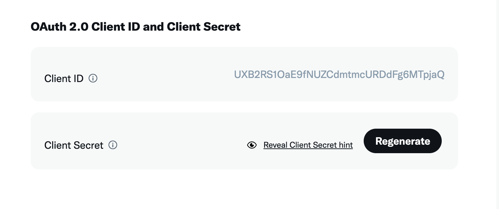
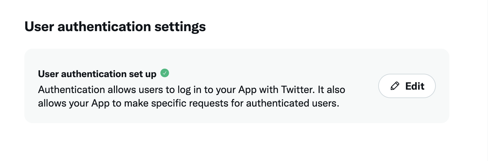
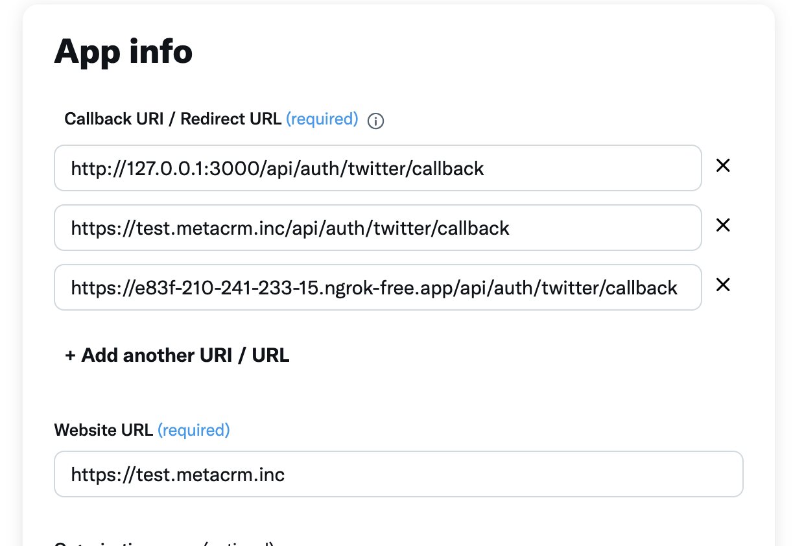

# Twitter Oauth Express Backend

## 前置準備

在開始實作之前，你需要確保已經安裝以下工具和程式庫：

## 工具

- **Node.js**：確保你的系統上已經安裝了 Node.js（建議使用最新版）。
- **npm 或 Yarn**：Node.js 的包管理工具，用於安裝所需的程式庫。

## 必要程式庫

請使用以下指令來安裝所需的 npm 套件：

```bash
npm install express dotenv body-parser twitter-api-sdk
```

## 開始實作 X 開發者平台

你可以在 [Use Cases, Tutorials, & Documentation](https://developer.x.com/en) 網站上找到相關文件和使用範例。

首先，你需要在 X 開發者平台上獲取 `client_id` 和 `client_secret`。這些是與 Twitter API 進行身份驗證所需的關鍵憑證。



接著，你需要設定回調 URL。這個 URL 是當用戶授權應用程式訪問其 Twitter 資料後，Twitter 會重導向用戶的地址。你需要在開發者平台上將此 URL 設定為應用的回調 URL。

進來這個頁面 User Authentication 選項，點選 edit 設定。


設定 callback URL 為 http://localhost:3000/auth/callback。
其他欄位自行設定


## 實作 OAuth 2.0 授權流程

### 以下是範例程式碼，展示了如何實現 Twitter OAuth 認證流程。

```javascript
const authClient = new auth.OAuth2User({
  // 從環境變數中獲取 Client ID
  client_id: process.env.CLIENT_ID,
  // 從環境變數中獲取 Client Secret
  client_secret: process.env.CLIENT_SECRET,
  // 設定回調 URL，這裡替換為你的回調 URL
  callback: "http://127.0.0.1:8000/api/auth/twitter/callback",
  // 指定應用需要的權限範圍
  scopes: ["tweet.read", "users.read", "offline.access"],
});

// 一個隨機的字串，用來防止 CSRF 攻擊
const state = "123123";

// 生成授權 URL 並重導向用戶到 Twitter 進行身份驗證
app.get("/api/auth/twitter", (req, res) => {
  const authUrl = authClient.generateAuthURL({
    // 使用唯一的 state 作為 key
    state: state,
    // 使用 S256 作為 code challenge 方法
    code_challenge_method: "s256",
  });

  console.log("authUrl", authUrl);
  res.redirect(authUrl); // 將用戶重導向至 Twitter 的授權頁面
});

// 處理來自 Twitter 的回調
app.get("/api/auth/twitter/callback", async (req, res) => {
  const { code, state } = req.query;
  console.log("code", code, "\n state", state);
  if (!code || !state) {
    // 如果沒有 code 或 state，返回錯誤
    return res.status(400).send("Missing code or state");
  }

  try {
    // 使用 code 請求存取令牌
    const tokenResponse = await authClient.requestAccessToken(code);
    console.log("Token Response:", tokenResponse);
    // 使用存取令牌初始化 Twitter 客戶端
    const twitterClient = new Client(authClient);

    // 現在可以使用 twitterClient 調用 Twitter API
    // 例如：獲取已認證用戶的個人資料
    const user = await twitterClient.users.findMyUser();
    console.log("user", user);

    res.send("Authorization successful! You can now close this window."); // 成功訊息
  } catch (error) {
    console.error("Error during token exchange:", error);
    if (!res.headersSent) {
      // 如果發生錯誤，返回錯誤訊息
      res.status(500).send("Error during token exchange");
    }
  }
});
```

### 說明

1. **authClient 設置**：

   - 使用 `OAuth2User` 建立一個 OAuth 客戶端，該客戶端需要 `client_id`、`client_secret` 和回調 URL。這些憑證和 URL 必須與你在 X 開發者平台上設定的一致。

2. **生成授權 URL**：

   - 當用戶訪問 `/api/auth/twitter` 路徑時，伺服器會生成一個 Twitter 的授權 URL 並將用戶重導向到該頁面。在這裡，用戶可以授權應用訪問他們的 Twitter 資料。

3. **處理回調**：

   - 當用戶授權完成後，Twitter 會將用戶重導向到你設定的回調 URL，並附帶授權碼（code）和狀態（state）。伺服器接收到這些資料後，可以使用授權碼請求存取令牌。

4. **使用 Twitter API**：

   - 獲得存取令牌後，你可以使用它來調用 Twitter API，進行各種操作，例如獲取用戶資料、發推文等。

5. **錯誤處理**：
   - 如果在授權過程中發生錯誤，伺服器會返回適當的錯誤訊息，並記錄錯誤詳細信息。
